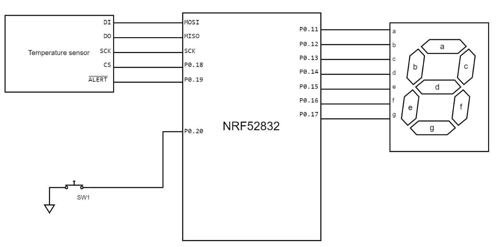
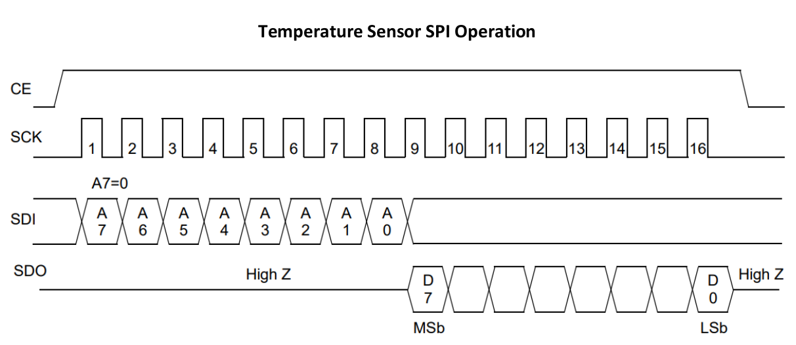
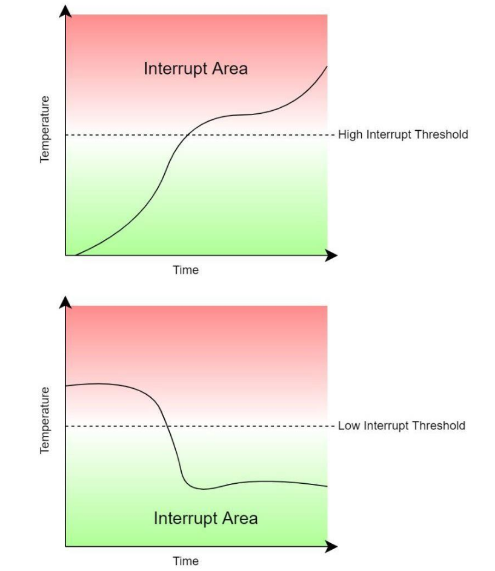
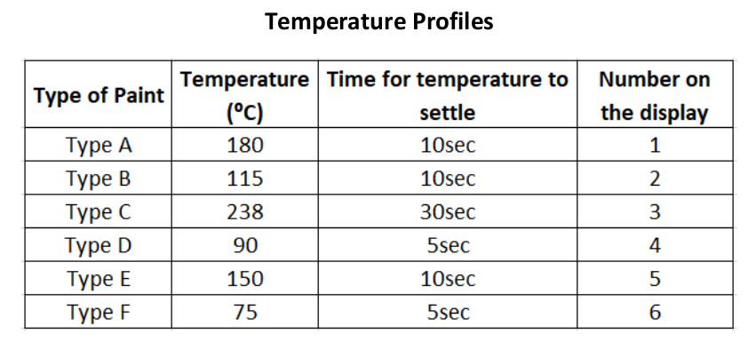
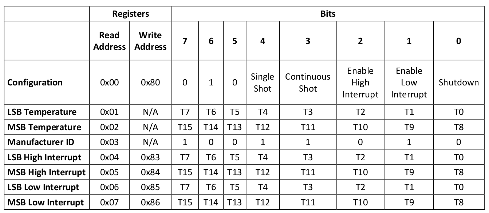

# Sensefinity IoT Solution for Logistic Market

[Sensefinity](https://www.sensefinity.com/) is a Portuguese start-up that provides IoT solutions for the logistic market. I took on this challenge on May 24th, submitted it, and had a technical review with some engineers of the team. My solution was widely accepted, and I received great feedback on my event-driven approach.

## 1. The Challenge

The following image describes an embedded system based on an NRF52832 microcontroller that supervises a curing oven in a spray paint assembly process. The oven is maintained at an exact temperature during paint curing. The temperature profiles are predefined on a table attached to the oven and are described on the last page of the challenge. The temperature is measured via a SPI temperature sensor mounted on the oven. There is a single switch used by the operator to set a different temperature profile to be monitored. The 7-segment display is the graphical interface used to give feedback to the operator on what temperature profile is currently being monitored.

The display flashes ‘H’ (high) at 1Hz when the temperature is 3⁰C over the target and ‘L’ (low) when the temperature is 3⁰C below the target. If an error is detected, the display should flash ‘E’ (error) at 1Hz. The system initializes with no temperature profile, with the display blinking ‘0’ at 5Hz. To select a profile, the user clicks on the switch once and the system must display the number of the first profile on the display blinking at 1Hz. If the user clicks again on the switch, the system must display the next profile in the same way. If the user reaches the end, the system must display the first profile again. If no other user input is detected, the profile is automatically set after 10 seconds, and the display keeps the profile number fixed.

The display must always indicate the profile number, except under the conditions defined above. Temperature changes are not instant, and the associated delays to reach a stationary temperature are also defined on the profile table. During this time, the system cannot trigger an alarm.

The temperature sensor is 16 bits, where the value is the actual temperature divided by 10, e.g., 381 = 38.1⁰C. The value ranges from 0⁰C to 409.5⁰C, and has 2 interrupts available: the high interrupt and the low interrupt, both of which can work on the same pin (ALERT). To clear the interrupt, the 0x01 register needs to be read.

## 2. Questions

a) Draw state diagrams and/or flowcharts that describe your solution to the problem.

b) Code the `sensor_init()` function that sets up the SPI with the correct CPOL and CPHA.

c) Code the `sensor_read()` function that gets the current value of the temperature already converted.

d) Code the `display_write(uint8_t number)` function that writes a given number on the display.

e) Implement the code represented by the diagram drawn in question a). Bear in mind that in the IoT world, the main goal is power efficiency, and that the NRF52 lineup can be very power efficient if programmed correctly. So, consider having efficient routines.
